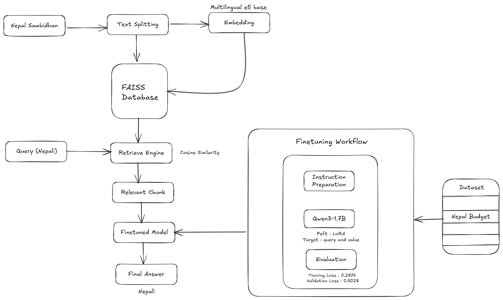

# ArthaBodh – Nepali Budget Intelligence System

An end-to-end Nepali Budget Question-Answering system that combines LoRA fine-tuned multilingual LLM + Retrieval-Augmented Generation (RAG) to deliver accurate, context-aware responses about Nepal’s national budget.

The system is designed to understand instruction-based Nepali queries, retrieve relevant sections from official budget documents, and generate grounded, concise answers.

---

## 🚀 Features

- Ask questions about Nepal’s national budget in Nepali

- Instruction-based Q&A format (Instruction + Context + Response)

- Fine-tuned multilingual LLM for domain-specific understanding

- RAG pipeline to reduce hallucination

- Context-grounded answers

- Streamlit interactive UI

- Deployable via Hugging Face or local inference

---

## 🧠 Tech Stack (with Purpose)

- **Qwen 1.7b (Fine-tuned with LoRA)**  
   Used as the **core language model**.
  Fine-tuned on structured Nepali instruction-response data to specialize in budget-related queries.

- **LoRA (Low-Rank Adaptation)**  
   Used to **generate dense multilingual embeddings** for reviews.  
   Used for parameter-efficient fine-tuning.
  Instead of training the full model, LoRA updates only attention projections (q, v) — making training lightweight and memory efficient.

- **XLM-RoBERTa (Fine-tuned)**  
  Used for **sentiment analysis**.  
  The model is fine-tuned on review data, enabling accurate sentiment detection for multilingual and code-mixed customer feedback.

- **Facebook BART Large CNN**  
  Used for **abstractive summarization**.  
  Generates concise, high-quality summaries for each topic group.

- **Playwright**  
  Used for **scraping Daraz reviews**.  
  Handles JavaScript-rendered and dynamically loaded content that traditional scrapers cannot reliably extract.

- **FastAPI**  
  Used as the **backend service**.  
  Handles scraping and heavy NLP processing while keeping the system modular and scalable.

- **Streamlit**  
  Used for building the **interactive user interface**.  
  Displays topics, summaries, and expandable review sections cleanly.

- **Python**  
  Core language used for orchestration, NLP pipelines, backend logic, and scraping.

---

## 🏗️ System Architecture & Workflow

### 🔄 Overall Workflow Diagram



### Workflow Explanation

1. User asks a budget-related question in Nepali

2. Question is embedded using multilingual embedding model

3. FAISS retrieves relevant budget document chunks

4. Context + Instruction formatted prompt is created

5. Fine-tuned Qwen model generates answer

6. Answer displayed in Streamlit UI

---

## 🧪 Model Fine-tuning Pipeline

---

## ⚙️ Installation

### 1. Clone the repository

```bash
git clone https://github.com/roshan-acharya/Review-Analyzer.git
cd Review-Analyzer
```

### 2. Create virtual environment

```
python -m venv venv
source venv/bin/activate      # Linux / Mac
venv\Scripts\activate         # Windows
```

### 3. Install dependencies

```
pip install -r requirements.txt
```

### 4. Save Finetuned Model

```
cd Finetune
python save_model_to_use.py
```

### 5. Start UI

```
cd RAG
streamlit run app.py
```

## 🎯 Why RAG + Fine-Tuning?

- Fine-tuning improves domain understanding

- RAG ensures factual grounding

- Together → Reduced hallucination + Accurate contextual answers

## ⚠️ Limitations

- Model performance depends on dataset quality

- Limited training samples may reduce generalization

- Requires proper chunking for best RAG performance

- Large documents may increase latency

## 👤 Author

Loblesh Bhartal(RAG) & Roshan Acharya(Finetune)
AI/ML Enthusiast
Creator of ArthaBodh
